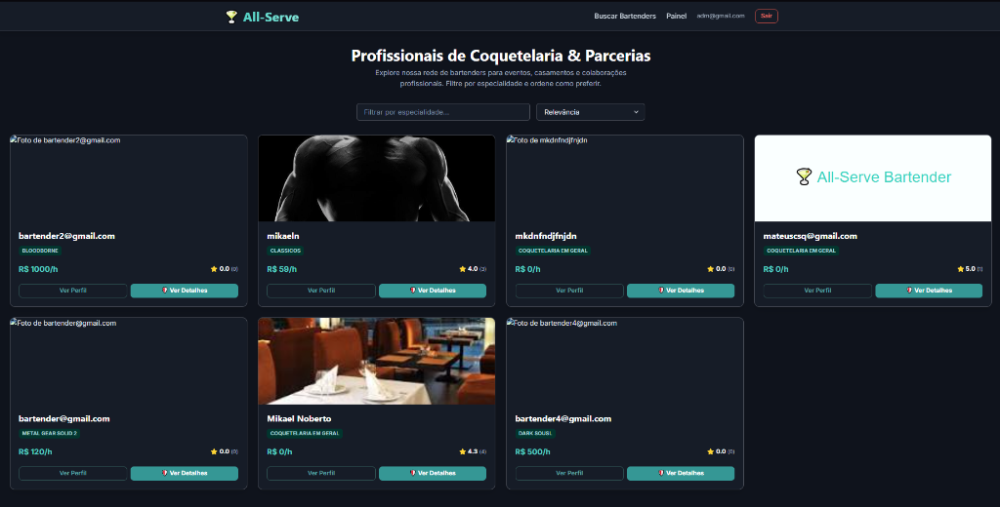
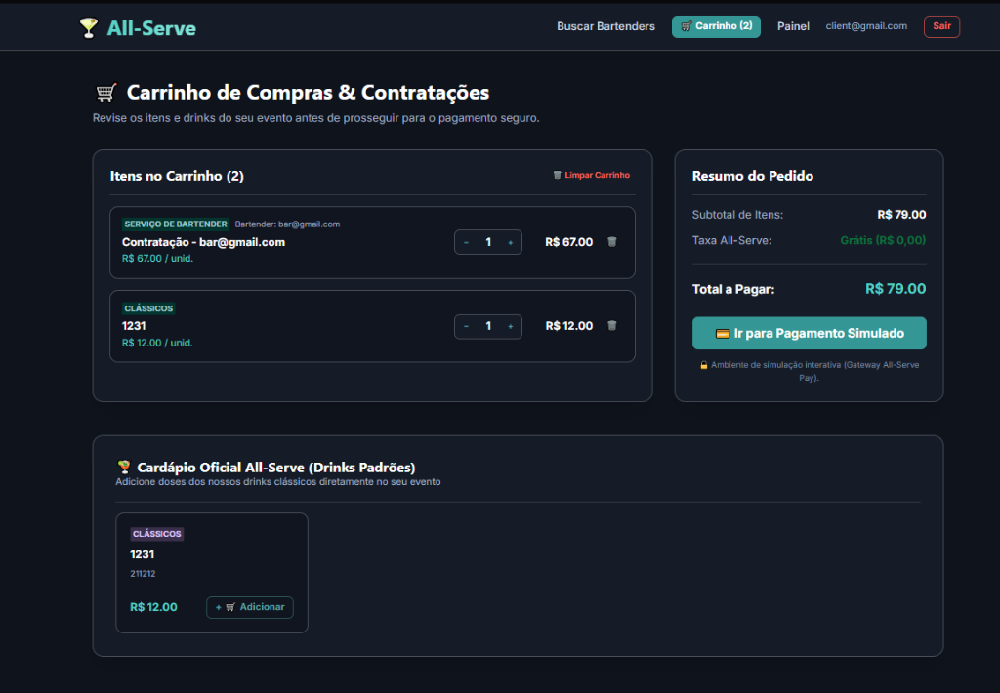
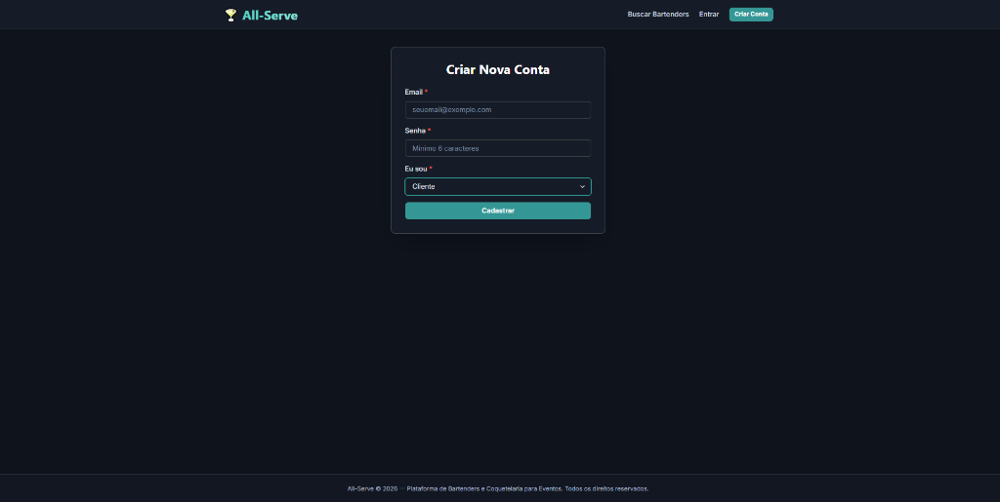
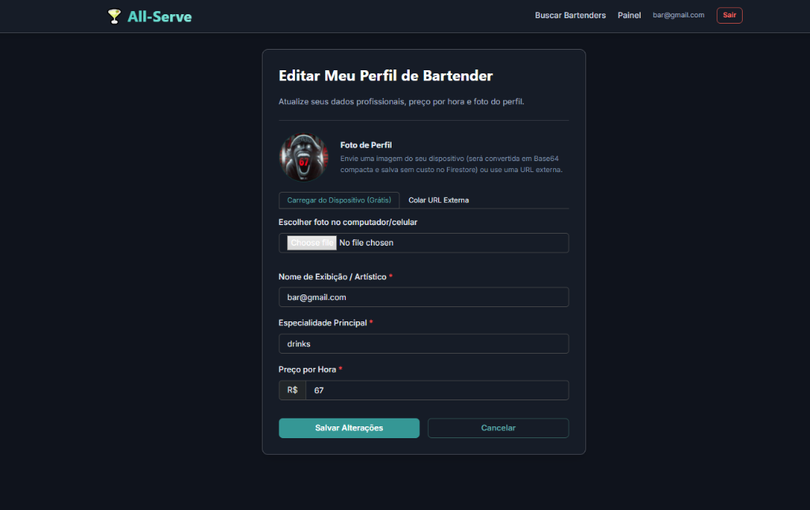
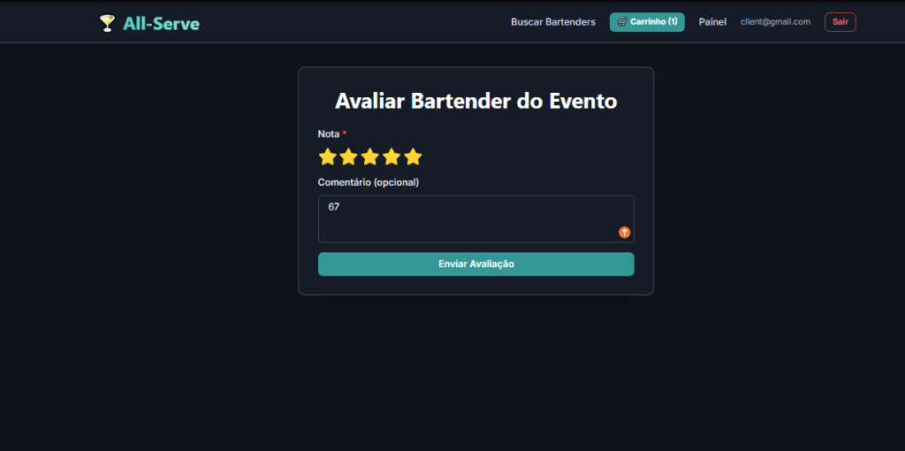

# 🍸 All-Serve — Plataforma de Bartenders & Coquetelaria para Eventos

[](https://reactjs.org/)
[](https://vitejs.dev/)
[](https://firebase.google.com/)
[](https://chakra-ui.com/)
[](./DEV_README.md)

> **Bem-vindo ao All-Serve!** Um marketplace web moderno, seguro e de alto padrão visual projetado para revolucionar a contratação e reserva de bartenders especializados para casamentos, festas e eventos corporativos.

---

## 💡 Sobre a Proposta (Resumo Executivo para RH & Recrutadores)

O **All-Serve** resolve uma necessidade crucial no mercado de eventos: conectar pessoas que buscam coquetelaria de excelência aos melhores profissionais de mixologia e bar, de forma transparente, rápida e segura.

Diferente de sistemas genéricos, o **All-Serve** foi idealizado com uma arquitetura de **Controle de Acesso Baseado em Papéis (RBAC)** em que **cada perfil possui sua própria experiência de uso, textos e ferramentas exclusivas**:
- **Clientes** exploram vitrines de profissionais, montam o carrinho para seus eventos e avaliam os serviços prestados.
- **Bartenders** gerenciam sua reputação, valores por hora, especialidades e colaboram em parcerias com colegas do setor.
- **Administradores** supervisionam a saúde da plataforma com auditoria financeira, moderação de avaliações e gestão de usuários.

---

## ✨ Principais Diferenciais da Plataforma

- 🎨 **Design Noturno Premium (Dark Mode):** Interface visual focada em elegância, contraste suave e usabilidade, remetendo aos melhores bares contemporâneos (`#0f131c` e tons turquesa/teal).
- 🔐 **Autenticação com Controle de Papéis (RBAC):** Login e cadastro adaptativos em 3 papéis (**Cliente**, **Bartender** e **Administrador**), alterando botões, modais e funções em tempo real.
- 🍸 **Vitrine Inteligente & Filtros em Memória:** Pesquisa instantânea por especialidade ("Drinks Clássicos", "Coquetelaria Autoral", etc.) com sistema de resiliência a acentos e dados.
- 🛒 **Carrinho de Compras & Orçamentos:** Permite ao cliente calcular orçamentos por hora, somar doses avulsas do cardápio oficial e simular checkouts seguros.
- ⭐ **Avaliações Dinâmicas:** Sistema de reputação por estrelas (1 a 5) com textos e labels contextualizados para avaliação de evento (Cliente) ou feedback profissional (Bartender).

---

## 📸 Vitrine Visual do Sistema

### 1. Pesquisa e Filtros de Bartenders
A vitrine permite explorar a rede de profissionais por especialidade e valor, exibindo nota média em estrelas e acesso direto a orçamentos e parcerias.



---

### 2. Carrinho de Compras & Gateway Simulado
O cliente revisa os serviços contratados, calcula o total por horas e adiciona doses extras do cardápio padrão antes de simular o pagamento.



---

### 3. Cadastro Inteligente com Seleção de Perfil (RBAC)
No momento da criação da conta, o usuário escolhe se deseja atuar como **Cliente** ou como **Bartender**, definindo suas permissões na plataforma.



---

### 4. Gestão de Perfil Profissional
Bartenders possuem acesso à edição de perfil, alterando nome artístico, especialidade principal, valor da hora trabalhada e foto em Base64 sem custo adicional.



---

### 5. Avaliação de Serviços e Eventos
Ao concluir um evento, clientes ou parceiros avaliam o profissional com estrelas e comentários em um modal interativo e reativo.



---

## 👥 Como Funciona para Cada Perfil?

### 👩‍💼 1. Para o Cliente
- Acessa o catálogo de profissionais de coquetelaria em `/buscar`.
- Solicita orçamentos para eventos (Casamentos, Confraternizações, Festas).
- Adiciona contratações ao **Carrinho de Compras** e finaliza pagamentos simulados.
- Deixa feedback na seção **"Avaliar Bartender do Evento"**.

### 🍸 2. Para o Bartender (Profissional)
- Exibe suas habilidades e preço/hora na vitrine pública.
- Recebe propostas de trabalho para eventos e comemorações.
- Pode convidar outros bartenders para **🤝 Propor Parceria / Colaboração** em eventos maiores.
- Deixa feedback construtivo na seção **"Avaliação entre Colegas Bartenders"**.

### 🛡️ 3. Para o Administrador
- Supervisiona contas do sistema através do módulo de gestão de usuários.
- Pode banir ou reativar perfis para manter a segurança da plataforma.
- Audita relatórios financeiros de vendas e modera comentários denunciados.

---

## 🚀 Como Rodar o Projeto (Guia Rápido)

O projeto foi configurado para ser iniciado com apenas **2 comandos**:

### 1. Instalar Dependências
```bash
npm install
```

### 2. Iniciar Servidor de Desenvolvimento
```bash
npm run dev
```

Acesse a plataforma diretamente em: **`http://localhost:5173`** 🍸

> *Dica para testes:* Você pode criar uma conta gratuita selecionando *"Eu sou: Cliente"* ou *"Eu sou: Bartender"* no cadastro, ou testar a vitrine pública sem login!

---

## 🛠️ Documentação Técnica para Desenvolvedores

Se você é **Desenvolvedor, Tech Lead ou Revisor de Código** e deseja analisar a modelagem NoSQL, segurança do Firebase, regras de RBAC, rotas protegidas e estratégias de performance implementadas na aplicação:

### 👉 [Acesse o Guia Completo do Desenvolvedor (DEV_README.md)](./DEV_README.md)

No arquivo técnico você encontrará:
- Diagramas da Arquitetura SPA (React 18 + Vite + Chakra UI)
- Estrutura Completa das Coleções e Subcoleções no Firestore (`/users`, `/avaliacoes`, `/agendamentos`, `/cardapio_plataforma`)
- Explicação do sistema polimórfico de componentes e rotas por papel (`userRole`)
- Scripts de linting (`npm run lint`) e build de produção (`npm run build`)

---

<p align="center">
  <b>All-Serve © 2026</b> — Conectando pessoas e eventos à melhor coquetelaria profissional.
</p>
